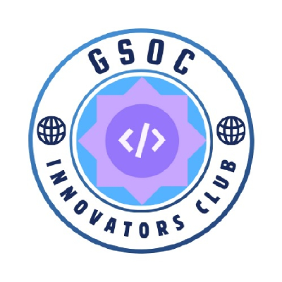

  

<h1 align="center">
    GSOC Innovators Club
</h1>

A Tech Club at VIT Bhopal University, focused on open source, Google Summer of Code preparation, and collaborative software projects.

## What We Do

We help students at VIT Bhopal explore open source software development, build real-world projects, and prepare for programs like Google Summer of Code. Our work spans web development, systems programming, and applied engineering, carried out through workshops, mentorship, and hands-on club projects.

## Repositories

- **[GSoC-Innovators-Club-New-Official-Website](https://github.com/GSOC-Innovators-Club/GSoC-Innovators-Club-New-Official-Website)** — Source code for our official club website.
- **[Talk-Space](https://github.com/GSOC-Innovators-Club/Talk-Space)** — A video calling application built with Go, TypeScript, and Kotlin for connecting with people online.

## Get Involved

We welcome VIT Bhopal students interested in open source and software development. Reach out through any of the channels below to learn more or get involved.

## Connect With Us

- Website: [gsoc-innovators-club-vitb.vercel.app](https://gsoc-innovators-club-vitb.vercel.app/)
- LinkedIn: [GSOC Innovators](https://www.linkedin.com/company/gsoc-innovators/)
- Instagram: [@gsoc_innovators_club](https://www.instagram.com/gsoc_innovators_club/)
- Email: [gsocinnovators@gmail.com](mailto:gsocinnovators@gmail.com)